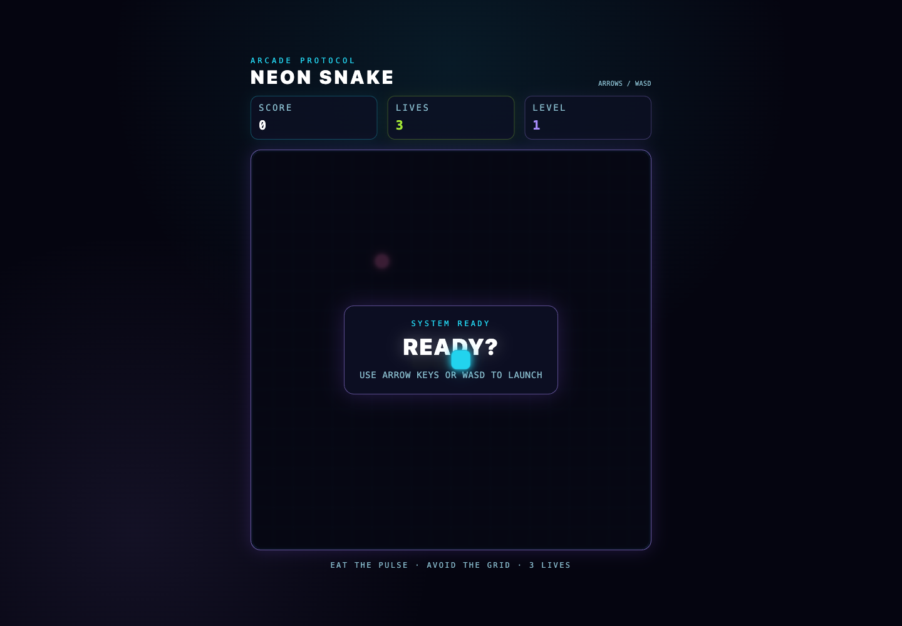

# Neon Snake

A keyboard-controlled Snake game built as an architecture and test-driven development exercise. It uses React, TypeScript, Tailwind CSS, and Vite, with pure domain transitions isolated from browser and React concerns.

## Run locally

```bash
npm install
npm run dev
```

Use the arrow keys or WASD to steer. The snake begins with three lives, gains 10 points per food, and speeds up every five foods. Wall and self-collisions cost one life while preserving the snake's position and length; steer away after the snake blinks. Press Enter to restart after game over or victory.

## Verification

```bash
npm run test:run
npm run typecheck
npm run lint
npm run format:check
npm run build
```

## Architecture

Pure functions in `GameService.ts` expose the domain seam:

```ts
createGameState(dependencies): GameState;
transitionGame(state, event, dependencies): GameState;
```

React hooks own keyboard and `requestAnimationFrame` integration. Components render immutable game state and contain no gameplay rules. See [the architecture diagrams](docs/architecture.md), [implementation plan](docs/implementation-plan.md), and [ADRs](docs/adr/) for the full design record.

`GameBoardService.ts` separately projects immutable game state into ordered semantic board cells, leaving `GameBoard.tsx` responsible only for Tailwind styling and DOM rendering.

## Screenshot


