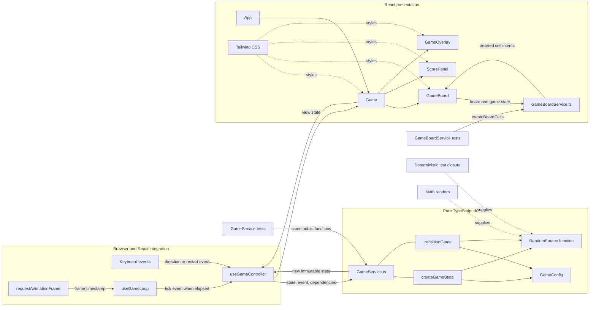
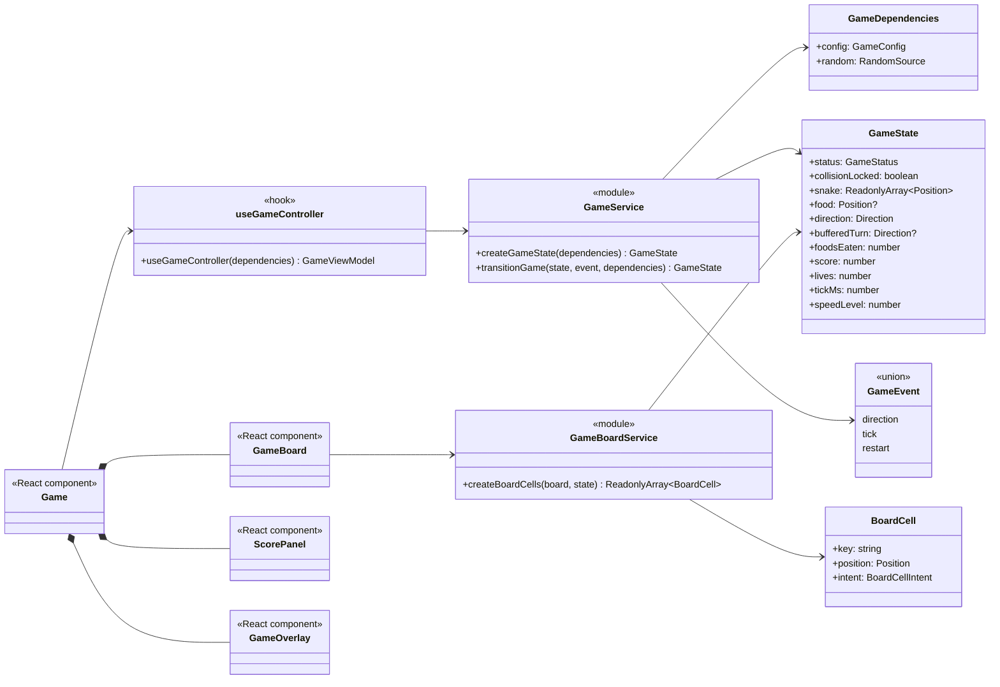
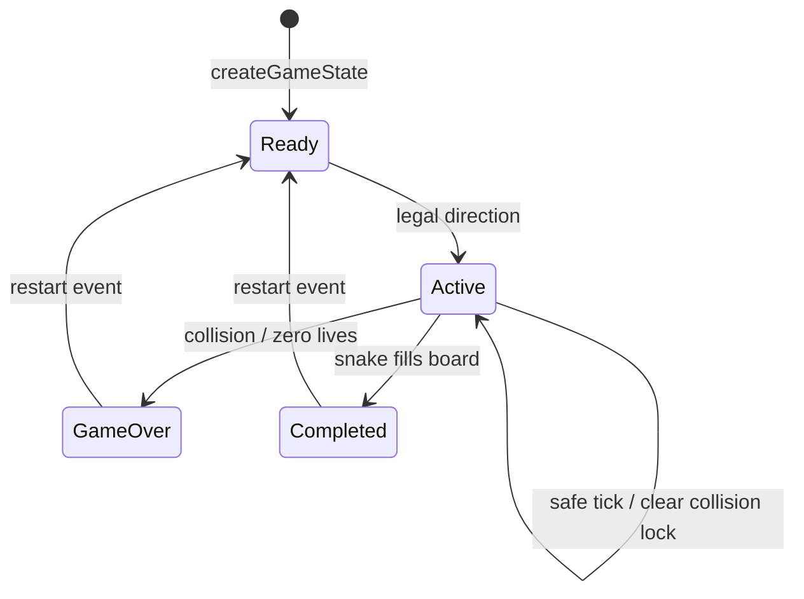

# Architecture

The React application delegates every gameplay decision to pure functions in `GameService.ts`. The `useGameController` hook owns React state and browser effects, while presentational components only render the returned state.

## Architecture Plan

## Module Diagram

## Game State Diagram

## Dependency Rules

- `GameService.ts` imports no React or browser modules and performs no side effects.
- `GameService.ts` exposes only `createGameState` and `transitionGame`; it contains gameplay rules, not board rendering projection.
- `GameBoardService.ts` converts configured positions and immutable game state into ordered semantic cell intents through `createBoardCells`.
- Dependencies such as configuration and randomness enter through function arguments.
- Randomness uses a function type, not a class hierarchy; production supplies `Math.random` and tests supply deterministic closures.
- `useGameController` owns keyboard listeners and React state updates; `useGameLoop` owns animation-frame timing.
- `GameBoard.tsx` maps cell intents to Tailwind classes and DOM elements; it does not calculate cell positions or inspect snake occupancy.
- A nonterminal collision preserves active state and all board entities. `collisionLocked` prevents repeated damage until a successful movement tick clears it.
- Tests exercise each approved public service seam; helper functions remain implementation details.
