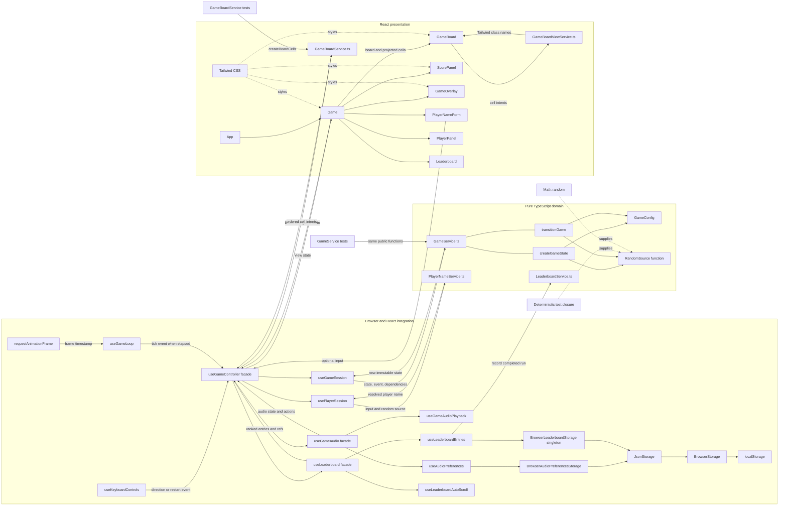
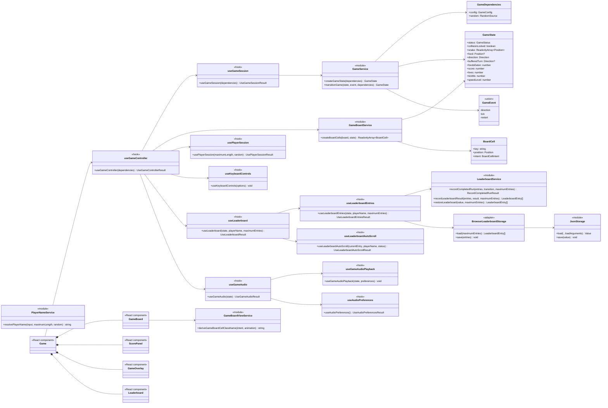
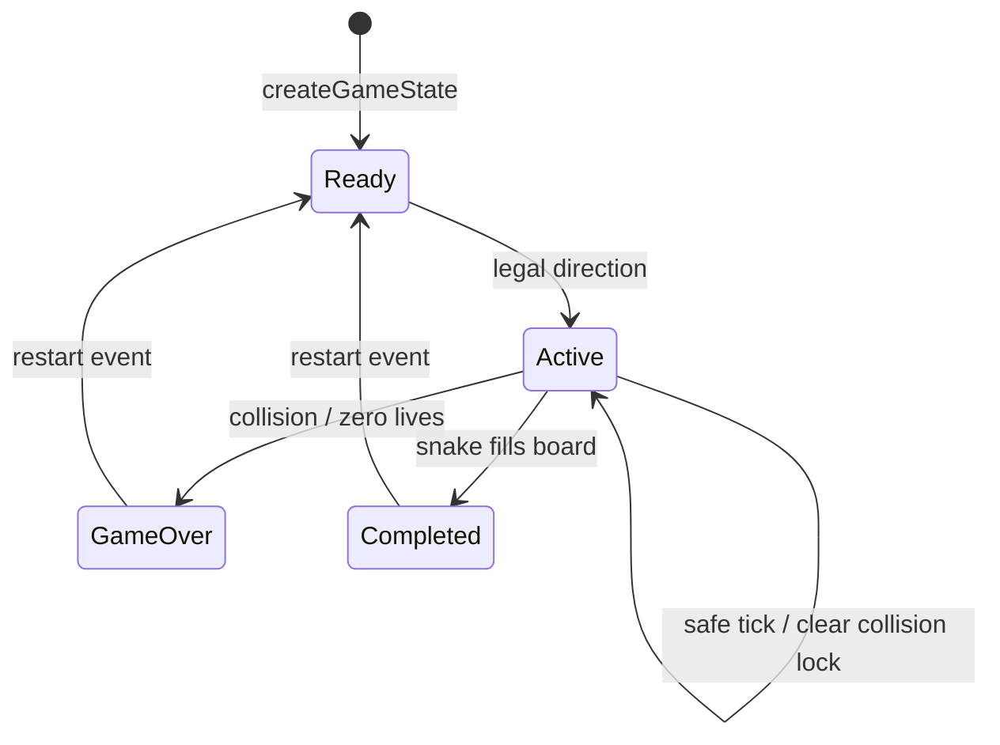

# Architecture

The React application delegates business decisions to pure modules. `useGameController` is a thin composition facade over single-intent game-session, player-session, keyboard, timing, leaderboard, audio, and responsive-presentation hooks. `useLeaderboard` and `useGameAudio` are smaller facades over their own use-case hooks. Presentational components render view state and emit user intent; browser adapters own platform I/O.

## Architecture Plan

## Module Diagram

## Game State Diagram

## Dependency Rules

- `GameService.ts` imports no React or browser modules and performs no side effects.
- `GameService.ts` exposes only `createGameState` and `transitionGame`; it contains gameplay rules, not board rendering projection.
- `GameBoardService.ts` converts configured positions and immutable game state into ordered semantic cell intents through `createBoardCells`.
- `GameBoardViewService.ts` maps a cell intent and animation state to its Tailwind classes.
- Dependencies such as configuration and randomness enter through function arguments.
- Randomness uses a function type, not a class hierarchy; production supplies `Math.random` and tests supply deterministic closures.
- `useGameController` is the thin feature composition seam. It exposes one view interface and coordinates `useGameSession`, `usePlayerSession`, `useKeyboardControls`, `useGameLoop`, `useLeaderboard`, `useGameAudio`, `useNarrowBoard`, and pure projection modules.
- `useGameSession` owns React game state and delegates every transition to `GameService`; `usePlayerSession` owns page-session player identity; `useKeyboardControls` owns only keyboard-to-game-event adaptation.
- `PlayerNameService.ts` owns player-name normalization, length validation, and random fallback generation; it imports neither React nor browser storage. `useGameController` derives whether player identity may change from the current game status as part of its view interface.
- `LeaderboardService.ts` owns terminal-transition eligibility, entry creation and validation, immutable ranking, tie-breaking, highlighting eligibility, and the configured entry limit.
- `LeaderboardStorage.ts` owns its versioned key and domain restoration. `AudioPreferencesStorage.ts` owns its key, defaults, and validation. Both compose the feature-local `JsonStorage.ts` mechanism for serialization, key-value I/O, and report-once failures; their browser adapters supply `window.localStorage` and the logger.
- `useLeaderboard` is a thin facade over `useLeaderboardEntries` and `useLeaderboardAutoScroll`. The entries hook reacts to game lifecycle and storage outcomes but delegates recording decisions to `LeaderboardService`; the auto-scroll hook owns only DOM refs and scrolling.
- `useGameAudio` is a thin facade over `useGameAudioPlayback` and `useAudioPreferences`. Audio preference rules live in `AudioPreferencesStorage.ts`; shared JSON persistence mechanics and browser composition stay behind their feature-local modules.
- `Game.tsx` is presentational and consumes only the view state and actions returned by hooks; leaderboard concerns do not enter `GameState` or `GameService`.
- `GameBoard.tsx` maps pre-projected cell intents to Tailwind classes and DOM elements; it does not call domain services, calculate cell positions, or inspect snake occupancy.
- A nonterminal collision preserves active state and all board entities. `collisionLocked` prevents repeated damage until a successful movement tick clears it.
- Tests exercise each approved public service seam; helper functions remain implementation details.
