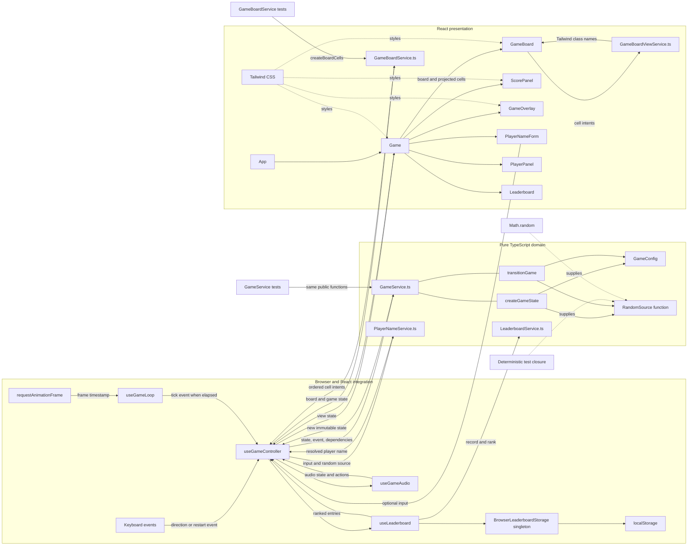
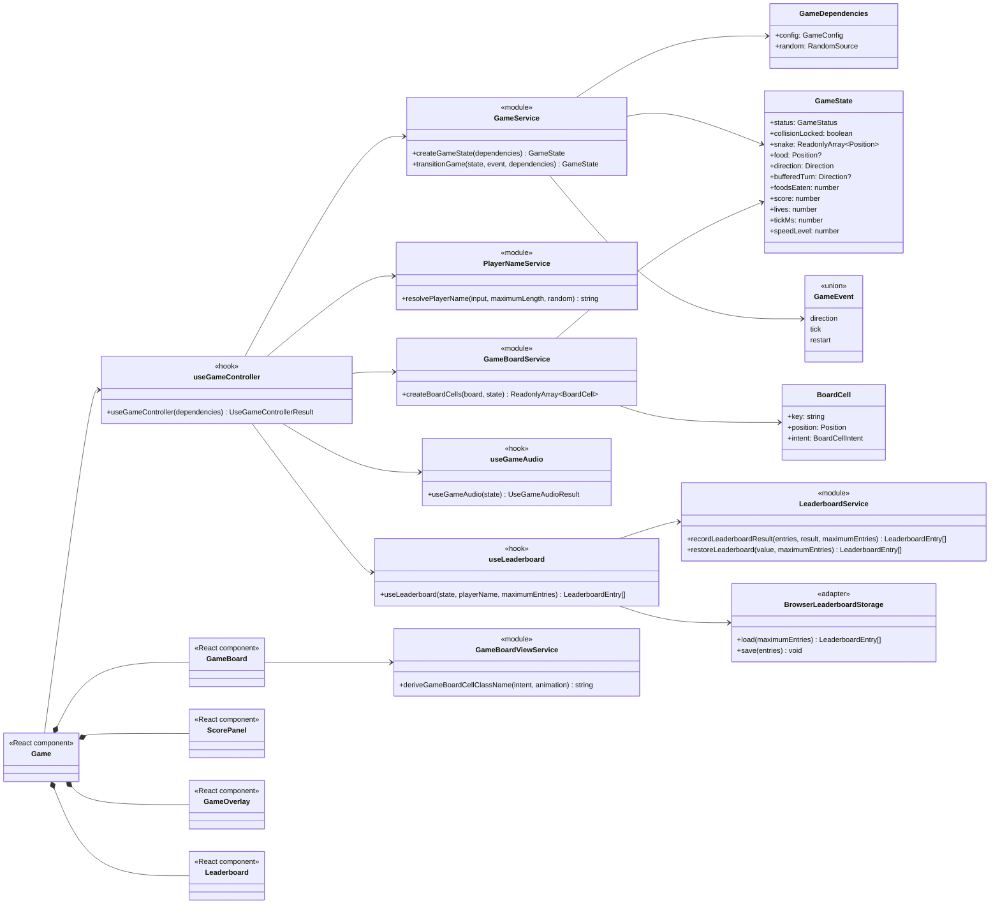
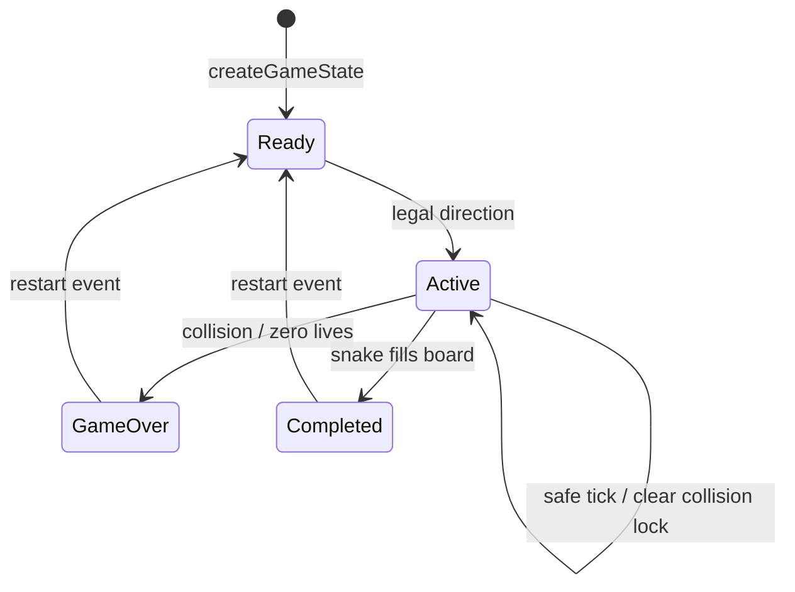

# Architecture

The React application delegates every gameplay decision to pure functions in `GameService.ts`. The `useGameController` composition hook owns gameplay and player-session state, coordinates feature hooks, and owns browser input effects. Local leaderboard rules remain in pure player-name and leaderboard modules, while `useLeaderboard` composes those rules with the browser-storage adapter. Presentational components only render state and emit user intent.

## Architecture Plan

## Module Diagram

## Game State Diagram

## Dependency Rules

- `GameService.ts` imports no React or browser modules and performs no side effects.
- `GameService.ts` exposes only `createGameState` and `transitionGame`; it contains gameplay rules, not board rendering projection.
- `GameBoardService.ts` converts configured positions and immutable game state into ordered semantic cell intents through `createBoardCells`.
- `GameBoardViewService.ts` maps a cell intent and animation state to its Tailwind classes.
- Dependencies such as configuration and randomness enter through function arguments.
- Randomness uses a function type, not a class hierarchy; production supplies `Math.random` and tests supply deterministic closures.
- `useGameController` is the feature composition seam. It owns gameplay and player-session state, exposes view state and user actions to `Game.tsx`, and coordinates `useGameLoop`, `useLeaderboard`, `useGameAudio`, `GameBoardService`, and pure services.
- `PlayerNameService.ts` owns player-name normalization, length validation, and random fallback generation; it imports neither React nor browser storage.
- `LeaderboardService.ts` owns persisted-entry validation, immutable ranking, tie-breaking, and the configured entry limit.
- `LeaderboardStorage.ts` owns the testable versioned JSON persistence implementation. `BrowserLeaderboardStorage.ts` composes it with `window.localStorage` and the logger as one production singleton that reports each load or save failure at most once.
- `useLeaderboard` records only transitions into a terminal state and keeps in-memory entries usable when persistence fails.
- `Game.tsx` is presentational and consumes only the view state and actions returned by hooks; leaderboard concerns do not enter `GameState` or `GameService`.
- `GameBoard.tsx` maps pre-projected cell intents to Tailwind classes and DOM elements; it does not call domain services, calculate cell positions, or inspect snake occupancy.
- A nonterminal collision preserves active state and all board entities. `collisionLocked` prevents repeated damage until a successful movement tick clears it.
- Tests exercise each approved public service seam; helper functions remain implementation details.
